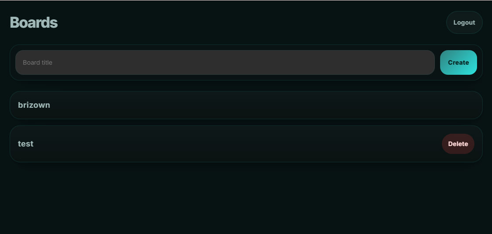
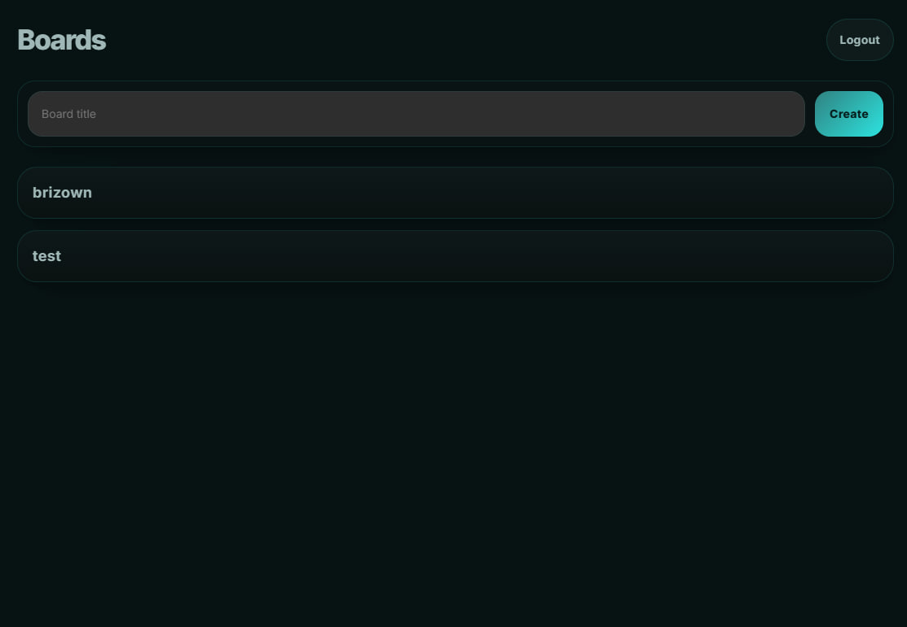
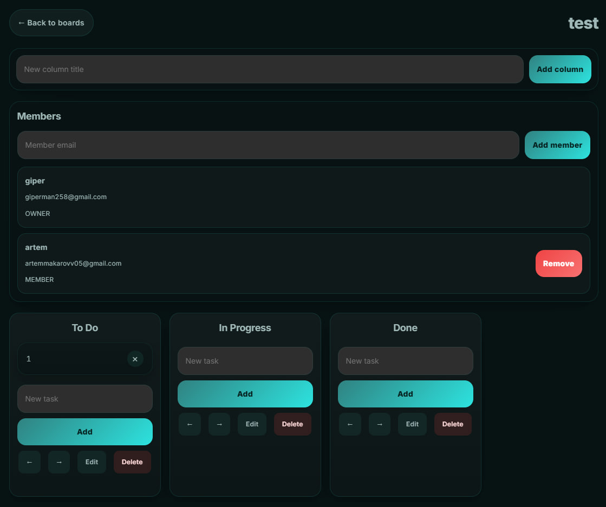
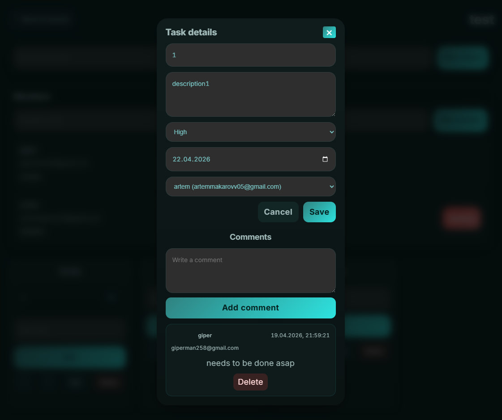
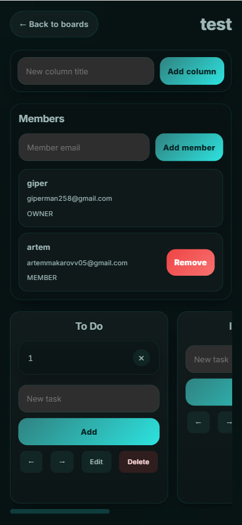

# TaskFlow (Jira-lite)

https://taskflow-jira-lite.vercel.app/
Tестовые данные для входа:
artemmakarovv05@gmail.com
222222

## Описание проекта

TaskFlow — веб-приложение разработанное с использованием React, TypeScript и Supabase.

Приложение поддерживает:

- регистрацию и вход пользователей
- создание и удаление досок
- работу с колонками и задачами
- drag-and-drop для задач
- комментарии
- совместный доступ к доскам
- роли owner / member
- realtime-обновления
- базовые тесты компонентов и маршрутов
- код проходит проверку линтером

## Технологии

- React
- TypeScript
- Vite
- Supabase
- React Router
- dnd-kit
- SCSS

## Интерфейс

## Реализованный функционал

### Уровень 1

#### Аутентификация

- регистрация по email и паролю
- вход и выход
- защита роутов для неавторизованных пользователей

#### Доски

- список доступных досок
- создание доски
- удаление доски
- переход на страницу доски

#### Колонки

- создание трёх колонок по умолчанию при создании доски
- добавление колонок
- удаление колонок
- переименование колонок
- изменение порядка колонок

#### Задачи

- создание задачи в колонке
- удаление задачи
- перенос задач между колонками через drag-and-drop

#### Базовый UI

- адаптивная вёрстка
- тёмная тема
- лоадеры
- уведомления об ошибках и успешных действиях

### Уровень 2

#### Детали задачи

- открытие задачи в модальном окне
- редактирование названия
- описание
- приоритет
- дедлайн
- назначение исполнителя

#### Комментарии

- список комментариев
- добавление комментариев
- удаление комментариев
- отображение автора и времени

#### Realtime

- обновление задач и колонок в реальном времени при открытой доске

#### Совместный доступ

- приглашение пользователя на доску по email
- роли owner / member
- owner может управлять участниками
- owner может управлять структурой доски
- member может работать с задачами

## Ограничение доступа

Пользователь видит только те доски, в которых он является участником.

Для таблицы `boards` реализована базовая защита через RLS. Для остальных таблиц доступ в текущей версии дополнительно контролируется логикой приложения и ролями пользователей.

## Что можно улучшить

При наличии дополнительного времени можно доработать:

- полную настройку RLS для всех таблиц
- страницу профиля пользователя
- аватары пользователей
- поиск и фильтрацию задач
- лог активности на доске
- прикрепление файлов к задачам

## Установка и запуск

Клонировать репозиторий:

git clone https://github.com/dodik1000/taskflow-jira-lite
cd taskflow-jira-lite

Установить зависимости:

npm install

Создать .env:

cp .env.example .env

И заполнить переменные:

VITE_SUPABASE_URL=
VITE_SUPABASE_KEY=

Запустить проект:

npm run dev

## Проверка проекта

Проверка линтера:

npm run lint

Проверка типов:

npm run type-check

Запуск тестов:

npm run test:run
